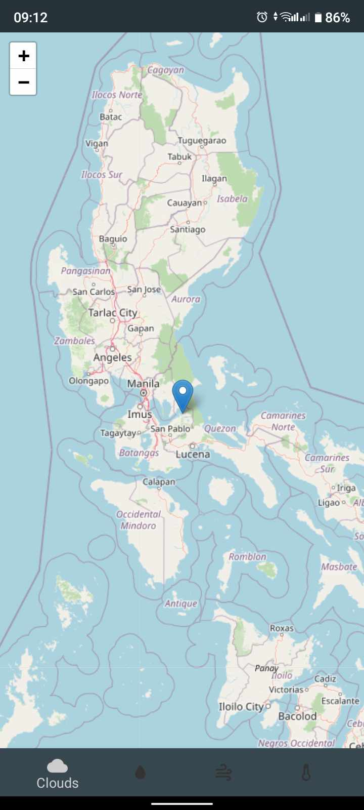

# SD-3101 [Weather forecast]


## Table of Contents
- [Introduction](#introduction)
- [Project Overview](#project-overview)
- [Objectives](#objectives)
- [Features](#features)
- [Technologies Used](#technologies-used)
- [Setup and Installation](#setup-and-installation)
- [Usage Instructions](#usage-instructions)
- [Project Structure](#project-structure)
- [Contributors](#contributors)
- [Chagelog](#changelog)
- [Acknowledgments](#acknowledgments)
- [License](#license)

---

## Introduction
Provide a brief introduction to the project. Explain the purpose, scope, and the problem it solves in a few sentences.

## Project Overview
Describe the project in detail. Include:
- The project's background or context.
- Its target audience or users.
- Any real-world applications or potential impact.

## Objectives
State the main objectives of the capstone project, such as:
- Develop a solution for [problem].
- Implement features to [goal].
- Test and validate [key aspect].

## Features
List the main features of the project:
- Feature 1: Brief description.
- Feature 2: Brief description.
- Feature 3: Brief description.

## Technologies Used
Mention the tools, frameworks, and technologies used in the project:
- Programming Languages: [e.g., Python, JavaScript, etc.]
- Frameworks/Libraries: [e.g., React, Flask, etc.]
- Databases: [e.g., MySQL, MongoDB, etc.]
- Other Tools: [e.g., Git, Docker, etc.]

## Setup and Installation
Step-by-step instructions for setting up the project locally.

1. **Clone the repository:**
   ```bash
   git clone https://github.com/your-repo-url.git
   ```
2. **Install dependencies:**
	- If using `npm`:
   ```bash
   git clone https://github.com/your-repo-url.git
   ```
   - If using `pip` (for Python projects):
   ```bash
   git clone https://github.com/your-repo-url.git
   ```
3. **Configure environment variables (if any)**: Provide instructions for setting up .env files or any other required configurations.
   ```bash
   git clone https://github.com/your-repo-url.git
   ```
4. **Run the project:**
   - For web projects:
   ```bash
   npm start
   ```
   - IFor backend services:
   ```bash
   python app.py
   ```

**Note:** If your project has external depencies like XAMPP, MySQL, special SDK, or other environemnt setup, create another section for it.

## Usage Instructions
Provide detailed instructions on how to use the project after setup:
- How to access the application.
- Navigate forecastie application on your mobile phone


- When you open the app, you will see
- Wind speed
- Pressure
- Humidity
- Sunrise time
- Sunset time
- and UV index
- weather for Today, Tomorrow, and the 4 days prior


- Click 3 dot at do top right corner of the screen
- You will see at the menu are
- Weather map, graphs, detect location, settings, and about


- At the weather map, you will see
- Clouds page


- Rain page
![UI Placeholder](forecastie_rain.jpg

- Wind page


- Temperature page


## Project Structure
Explain the structure of the project directory. Example:
```bash
.
└── forecastie/
    ├── .circleci/
    │   └── config.yml
    ├── .git/
    │   ├── hooks/
    │   │   └── ..
    │   ├── info/
    │   │   └── ..
    │   ├── logs/
    │   │   └── ..
    │   ├── clients/
    │   │   └── ..
    │   ├── refs/
    │   │   └── ..
    │   ├── COMMIT_EDITMSG
    │   ├── config
    │   ├── description
    │   ├── HEAD
    │   ├── index
    │   └── packed-refs
    ├── .github/
    │   └── workflows/
    │       └── ..
    ├── .reuse/
    │   └── dep5
    ├── app/
    │   ├── src/
    │   │   └── ..
    │   ├── build.gradle
    │   └── proguard-rules.pro
    ├── fastlane/
    │   └── metadata/
    │       └── ..
    ├── gifs/
    │   └── gif_1
    ├── gradle/
    │   └── wrapper/
    │       ├── ..
    │       └── ..
    ├── LICENSES/
    │   ├── CC-BY-SA-2.0
    │   ├── CC-BY-SA-4.0
    │   ├── GPL-3.0-or-later
    │   └── OFL-1.1
    ├── tools/
    │   ├── reorderALL
    │   ├── reorderTemplate
    │   ├── translation-files-updater
    │   └── translation-progress
    ├── .gitignore
    ├── build gradle
    ├── CODE-OF-CONDUCT.md
    ├── CONTRIBUTING.md
    ├── gradle.properties
    ├── gradlew
    ├── gradlew
    ├── icon
    ├── LICENSE
    ├── README.es.md
    ├── README.fr.md
    ├── README.it.md
    ├── README.ko.md
    ├── README.md
    └── settings.gradle

## Contributors

List all the team members involved in the project. Include their roles and responsibilities:

- **Mark Joseph L**. Elazegui: Lead Developer, Backend Developer
- **Jaida Camille Colderia**: Frontend Developer, UI/UX Designer
- **Gerald Villaran**: Project Manager, Tester

## Project Timeline

Outline the project timeline, including milestones or deliverables. Example:

- **Week 1-2**: Research and project planning.
- **Week 3-5**: Design and setup.
- **Week 6-10**: Implementation.
- **Week 11-12**: Testing and debugging.
- **Week 13-14**: Final presentation and documentation.

## Changelog

### [Version 1.0.0] - 2024-09-07
- Initial release of the project.
- Added basic functionality for [Feature 1], [Feature 2], and [Feature 3].

### [Version 1.1.0] - 2024-09-14
- Improved user interface for [Feature 1].
- Fixed bugs related to [Feature 2].
- Updated project documentation with setup instructions.

### [Version 1.2.0] - 2024-09-21
- Added new functionality for [Feature 4].
- Refactored codebase for better performance.
- Added unit tests for [Feature 3] and [Feature 4].


## Acknowledgments

Acknowledge any resources, mentors, or external tools that helped in completing the project.

This project was built from [Original Project Name](https://github.com/username/original-repo), created by [Original Author's Name]. You can view the original repository [here](https://github.com/username/original-repo).

## License

LICENSES/GPL-3.0-or-later.txt

# se2024-colderia-elazegui
# se2024-colderia-elazegui
# Forecastie

[](https://github.com/martykan/forecastie/releases)
[](https://circleci.com/gh/martykan/forecastie/tree/master)
[](https://github.com/martykan/forecastie/releases=)

A simple, copylefted libre software weather app for Android. It gathers data from [OpenWeatherMap](https://openweathermap.org/), via their public API.

[](https://f-droid.org/repository/browse/?fdid=cz.martykan.forecastie)
[](https://play.google.com/store/apps/details?id=com.casticalabs.forecastie)

## Features
* Simple design
* Detailed 5 day forecast
* Multiple units
* Works with any city in the world
* Offline functionality

## Screenshots
[](https://i.imgur.com/8g7HPIL.png)
[](https://i.imgur.com/ye2O2B2.png)
[](https://i.imgur.com/olkk2cB.png)

## Demo


## Contribution
If you have any ideas or issues, don't hesitate to make contact via the Issues page. Every contribution is welcome. See [Contributing](https://github.com/martykan/forecastie/blob/master/CONTRIBUTING.md) for further information.

Please note that this project is released with a Contributor Code of Conduct. By participating in this project you agree to abide by its terms.

[](CODE-OF-CONDUCT.md)

## Licence
[](http://www.gnu.org/licenses/gpl-3.0.en.html)  

This application is Free Software: You can use, study share and improve it at your
will. Specifically you can redistribute and/or modify it under the terms of the
[GNU General Public License](https://www.gnu.org/licenses/gpl.html) as
published by the Free Software Foundation, either version 3 of the License, or
(at your option) any later version.

The weather data is provided by [OpenWeatherMap](https://openweathermap.org/), under the <a href='http://creativecommons.org/licenses/by-sa/2.0/'>Creative Commons licence</a>.

Icons are <a href='https://erikflowers.github.io/weather-icons/'>Weather Icons</a>, by <a href='http://www.twitter.com/artill'>Lukas Bischoff</a> and <a href='http://www.twitter.com/Erik_UX'>Erik Flowers</a>, under the <a href='http://scripts.sil.org/OFL'>SIL OFL 1.1</a> license.
